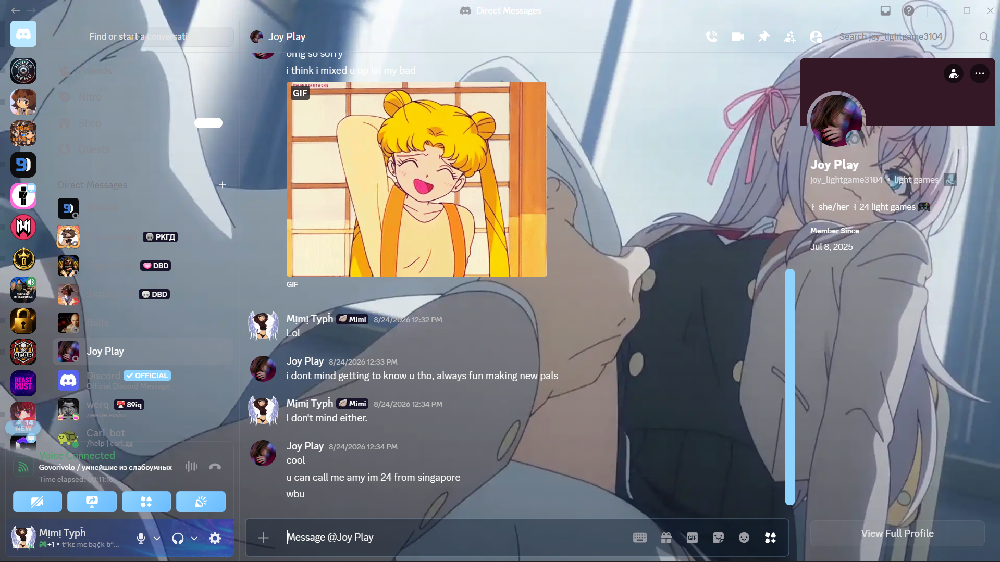
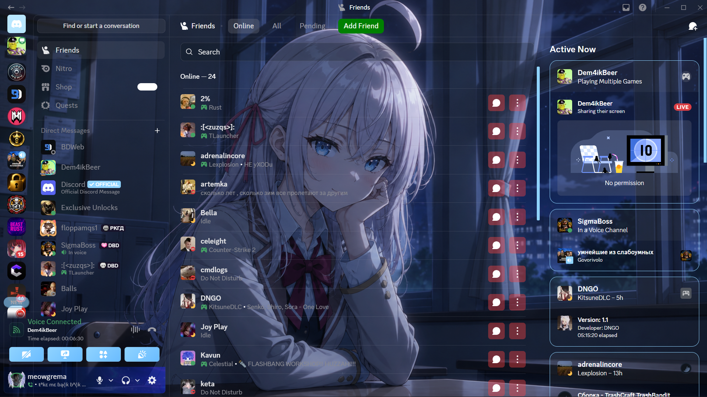
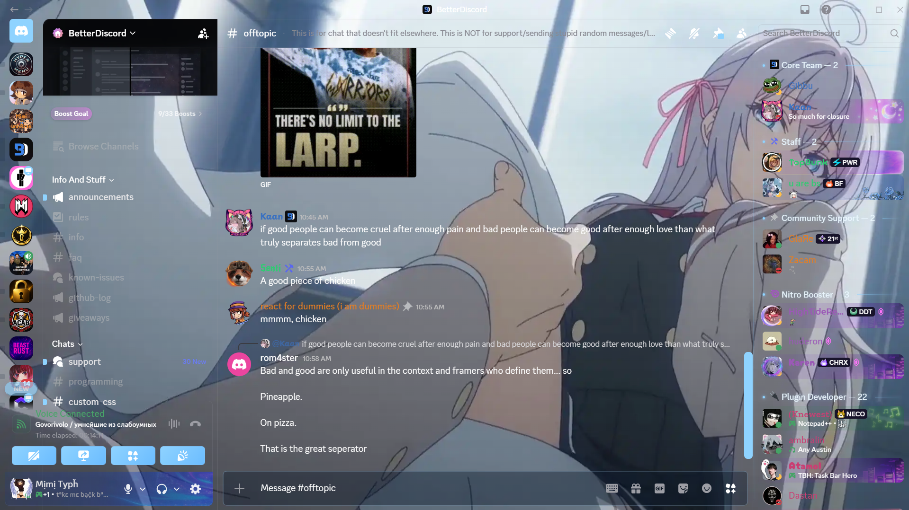

# ✦ Alya Glass

  <strong>A modern transparent glass-style theme for BetterDiscord.</strong>

  Clean • Transparent • Customizable • Lightweight

---

## ✨ Preview

---

## 🌸 About

**Alya Glass** is a custom BetterDiscord theme designed around a clean transparent glass aesthetic.

The goal of the theme is to make Discord feel more modern while keeping the interface readable, comfortable, and customizable.

### Features

* 🪟 Transparent glass-style interface
* 🎨 Custom Discord UI
* 👤 Improved profile appearance
* 🎮 Activity customization
* ⚙️ Easy CSS customization
* 🌙 Designed primarily for dark Discord
* 🪶 Lightweight styling
* ✨ Clean modern appearance

---

## 📦 Installation

### Requirements

* Discord
* BetterDiscord

Download and install BetterDiscord from the official website:

**https://betterdiscord.app/**

### Install Alya Glass

1. Download `AlyaGlass.theme.css`.
2. Open Discord.
3. Go to **User Settings → Themes**.
4. Open the **Themes Folder**.
5. Move `AlyaGlass.theme.css` into the folder.
6. Return to Discord.
7. Enable **Alya Glass**.

---

## 🎨 Customization

Alya Glass is designed to be easily customized.

You can modify the CSS to change things such as:

* Transparency
* Borders
* Backgrounds
* Rounded corners
* Profile elements
* Activity cards
* Colors
* Spacing
* UI elements

> Advanced customization requires basic knowledge of CSS.

---

## 🖥️ Compatibility

| Component       | Status                      |
| --------------- | --------------------------- |
| BetterDiscord   | ✅ Supported                 |
| Discord Desktop | ✅ Supported                 |
| Discord Web     | ⚠️ Not officially supported |
| Discord Mobile  | ❌ Not supported             |

Compatibility may change when Discord or BetterDiscord receives major updates.

---

## 🐛 Bug Reports

Found a problem?

Before creating an issue:

1. Make sure you are using the latest version of Alya Glass.
2. Make sure BetterDiscord is up to date.
3. Check existing Issues.
4. If the problem still exists, create a new Bug Report.

When reporting a bug, include:

* Alya Glass version
* BetterDiscord version
* Discord version
* Operating system
* Description of the problem
* Steps to reproduce it
* Screenshot or video if possible

See [CONTRIBUTING.md](CONTRIBUTING.md) for contribution guidelines.

---

## 💡 Feature Requests

Have an idea for Alya Glass?

Create a Feature Request and describe:

* What you want to add
* How it should work
* Why it would improve the theme

Useful and realistic ideas may be considered for future releases.

---

## 📜 License

Alya Glass is distributed under the **MIT License**.

See [LICENSE](LICENSE) for the full license text.

---

## 🔒 Security

If you discover a security vulnerability, please report it privately instead of publicly posting it.

See [SECURITY.md](SECURITY.md) for more information.

---

## 🤝 Contributing

Contributions are welcome!

You can help by:

* Fixing bugs
* Improving CSS
* Adding customization options
* Suggesting features
* Improving documentation
* Testing compatibility

Please read [CONTRIBUTING.md](CONTRIBUTING.md) before submitting a Pull Request.

---

## 📋 Changelog

See [CHANGELOG.md](CHANGELOG.md) for the complete version history.

### Current Version

**Alya Glass 1.0.0**

---

## ⚠️ Disclaimer

Alya Glass is an independent third-party theme.

**Alya Glass is not affiliated with, endorsed by, or officially connected to Discord or BetterDiscord.**

Discord and BetterDiscord are trademarks of their respective owners.

---

## 💜 Credits

Created and maintained by **Meowgrema**.

Thank you to everyone who tests Alya Glass, reports bugs, and contributes to the project.

---

  <strong>✦ Alya Glass</strong> 
  Made with CSS and ✨

