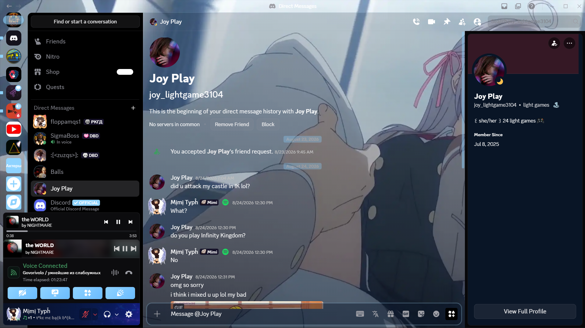
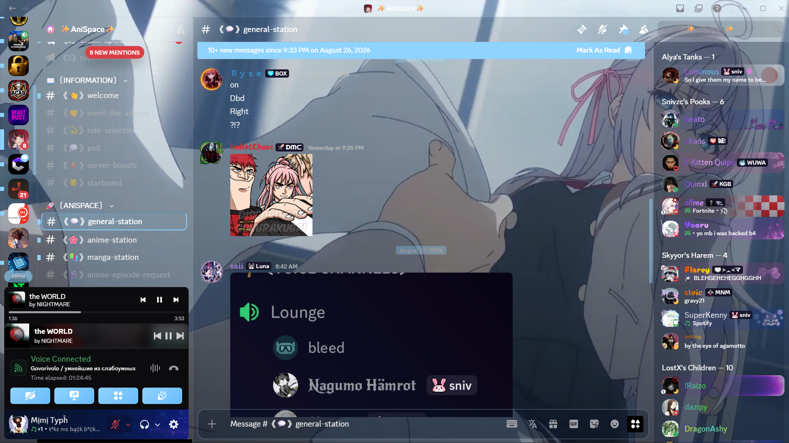

# Alya Glass

[Download betterdiscord](https://betterdiscord.app/)
[Source](https://github.com/bobrat641-prog/Alya-BetterDiscord)
### RU

Полупрозрачная аниме-тема для BetterDiscord в стиле **Alya**.

## 🖼️ Скриншоты





## ✨ Особенности

- 🖼️ Аниме-фон Alya
- 🪟 Полупрозрачные панели
- 🔵 Голубой акцентный цвет
- 💬 Стилизованные сообщения и упоминания
- 🎴 Прозрачные карточки и настройки
- 🔘 Кастомные кнопки
- 📋 Оформленные меню и всплывающие окна
- 🎨 Изменённые элементы BetterDiscord

### EN
# Alya Glass

A semi-transparent anime theme for BetterDiscord inspired by **Alya**.

## ✨ Features


- 🖼️ Alya anime background
- 🪟 Semi-transparent panels
- 🔵 Blue accent color
- 💬 Styled messages and mentions
- 🎴 Transparent cards and settings
- 🔘 Custom buttons
- 📋 Styled menus and popout windows
- 🎨 Customized BetterDiscord interface elements


---

# 🎨 Customization

## App elements

| Variable | Description | Default |
|---|---|---|
| `--alya-background` | Background image for the Discord application | Alya image |
| `--alya-panel` | Background color for standard transparent panels | `rgba(8, 22, 42, .38)` |
| `--alya-panel-strong` | Background color for stronger panels | `rgba(8, 22, 42, .55)` |

## Accent color

| Variable | Description | Default |
|---|---|---|
| `--alya-accent` | Main accent color used throughout the theme | `#8fd3ff` |
| `--alya-accent-hover` | Accent color when hovering over elements | `#b9e7ff` |

---

# 🖼️ Background

To change the background image, edit:

```css
--alya-background: url("YOUR_IMAGE_URL");

Use a direct image link for the best result.

🔵 Accent colors

You can change the main colors of the theme:

:root {
    --alya-accent: #8fd3ff;
    --alya-accent-hover: #b9e7ff;
}

Example with a pink accent:

:root {
    --alya-accent: #ff8fcf;
    --alya-accent-hover: #ffc2e5;
}
🪟 Panel transparency

The transparency of the interface can be adjusted here:

:root {
    --alya-panel: rgba(8, 22, 42, .38);
    --alya-panel-strong: rgba(8, 22, 42, .55);
}

The last value controls transparency:

0 — completely transparent
.25 — highly transparent
.50 — medium transparency
.75 — low transparency
1 — completely opaque
📥 Installation
Install BetterDiscord.
Download Alya.theme.css.
Move the file to your BetterDiscord themes folder.
Open Discord settings.
Go to Themes.
Enable Alya Glass.
🛠️ Author

Meowgrema

📄 Version

1.0
